# Snappet Mobile

Native iOS + Android app for **Snappet** — a suite of small daily-utility mini-apps that share one
on-device data layer to become a go-to daily app.

**Flagship feature:** workout-tracking + **HR-driven auto-highlight reels** — track a workout's heart
rate (Apple Watch / Wear OS / BLE band), film however you like, and the app auto-finds the media you
shot during the workout window and assembles a highlight reel ranked by heart-rate intensity, with
minimal manual editing.

> 🔒 **On-device only.** No backend, no accounts, no network sync, no analytics. Health and media data
> never leave the device.

## Screens

The iOS suite — a Home dashboard aggregating usage across mini-apps, an App Library, and the modules
themselves (Workout reels · Pomodoro · Habits · Journal · Tip · Split Expenses · Budget). Captured on
the iOS 26 simulator, themed with the **Snappet Pulse** design system (#30) — one warm Pulse-coral
brand accent, curated per-module accents, a shared spacing/radius/type scale, and full dark mode.

| Home dashboard | App Library | Workout (onboarding) |
|---|---|---|
|  |  |  |

| Pomodoro | Habits | Journal |
|---|---|---|
|  |  |  |

| Tip Calculator | Split Expenses | Budget |
|---|---|---|
|  |  |  |

**Live Workout Capture + Video Studio** — the WorkoutTracker turned into a live, instrumented, media-rich
workout: a live player (overall timer + live-HR overlay), an enriched HR summary (chart + time-in-zone)
and a heart-rate source picker (Apple Watch / BLE band).

| Workout dashboard | Routines | Routine detail |
|---|---|---|
| 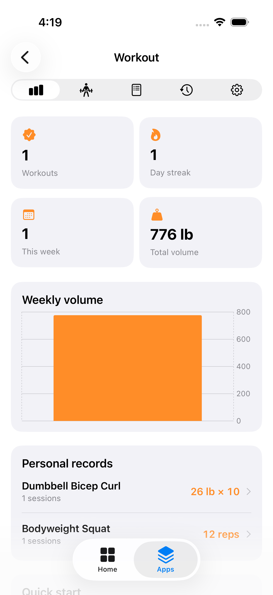 | 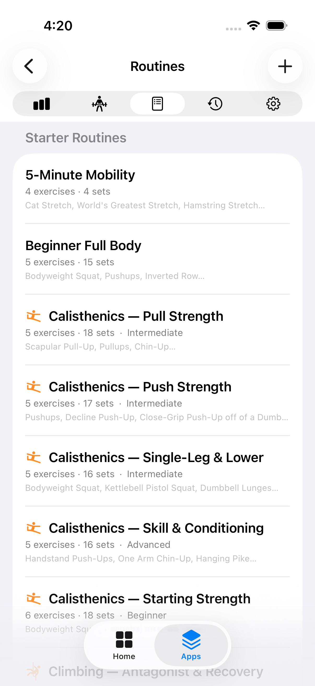 | 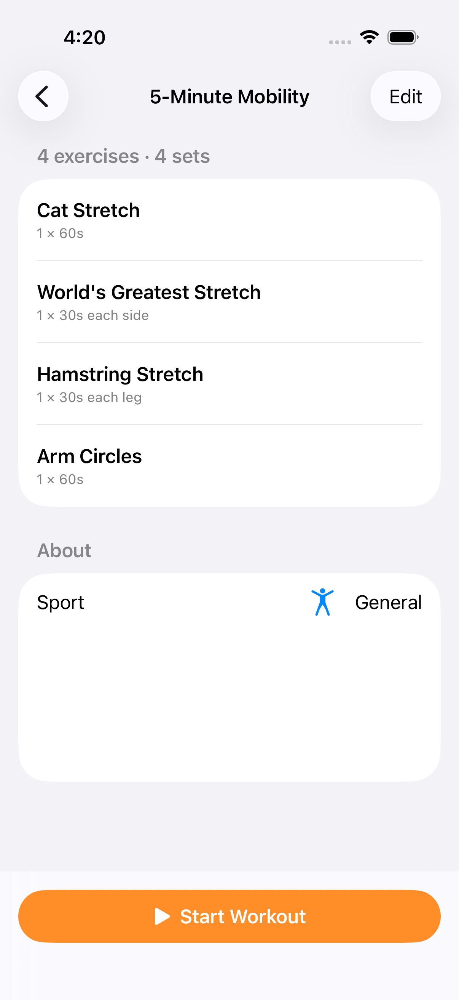 |

| Live player (timer + HR overlay) | History | HR summary (chart + zones) |
|---|---|---|
| 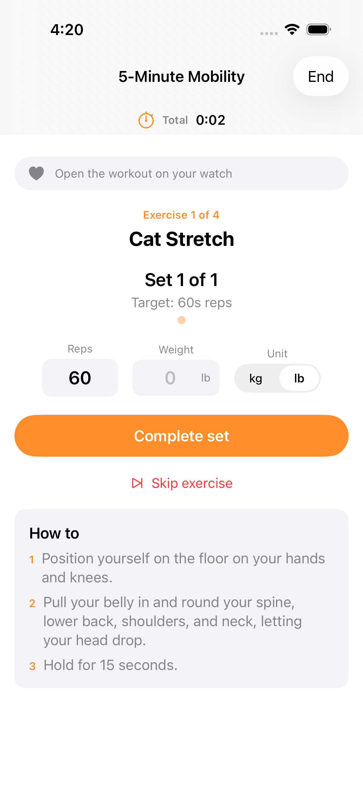 | 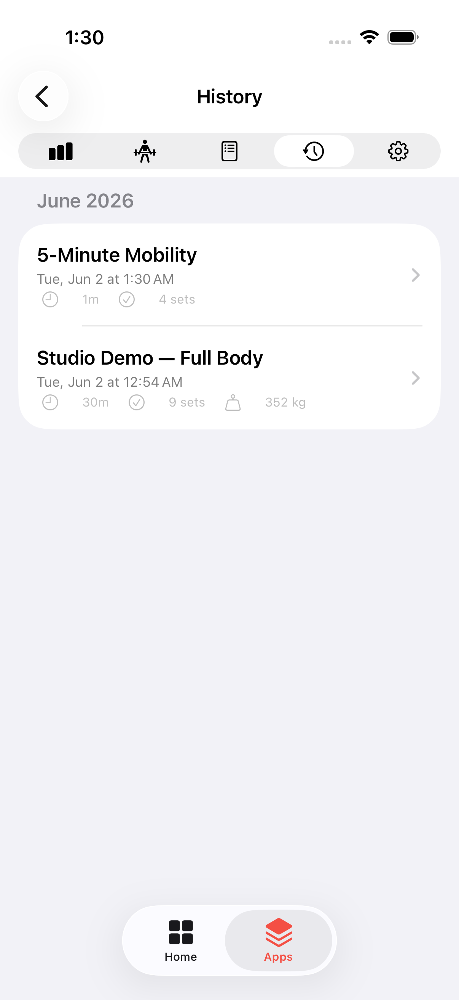 | 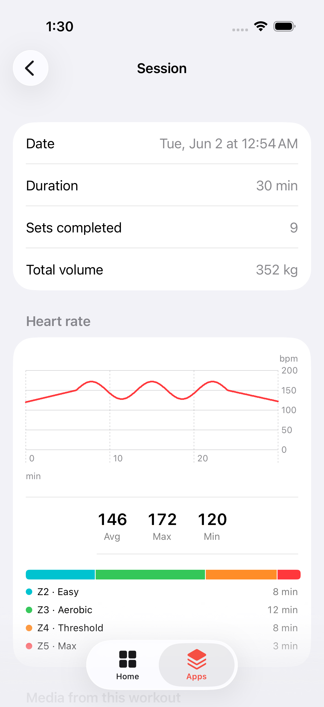 |

| Workout settings | HR source picker (auto-detect · Saved band) | |
|---|---|---|
| 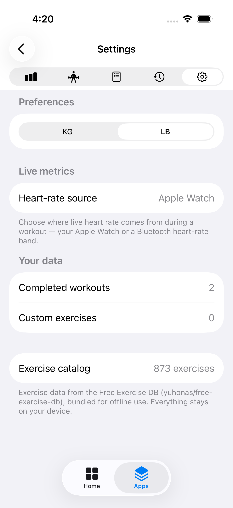 | 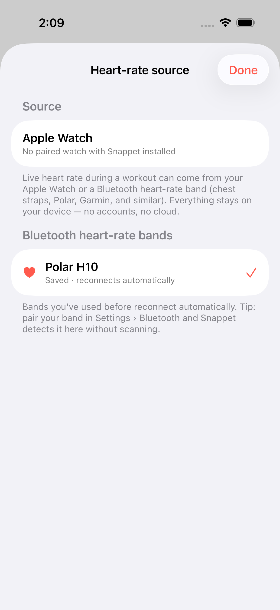 | |

### 🌙 Dark mode

Snappet Pulse renders from the same tokens in both appearances — warm near-black surfaces with the
same coral brand accent and per-module hues. Same screens as above, in dark.

<details>
<summary>Show dark-mode gallery</summary>

| Home dashboard | App Library | Workout (onboarding) |
|---|---|---|
|  | 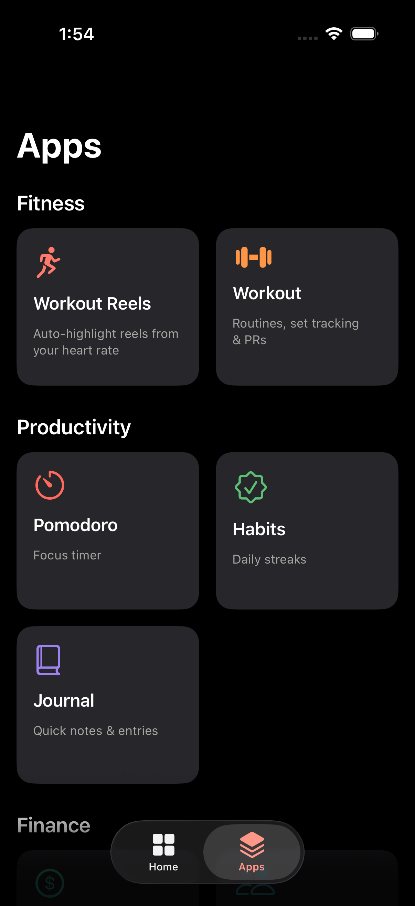 | 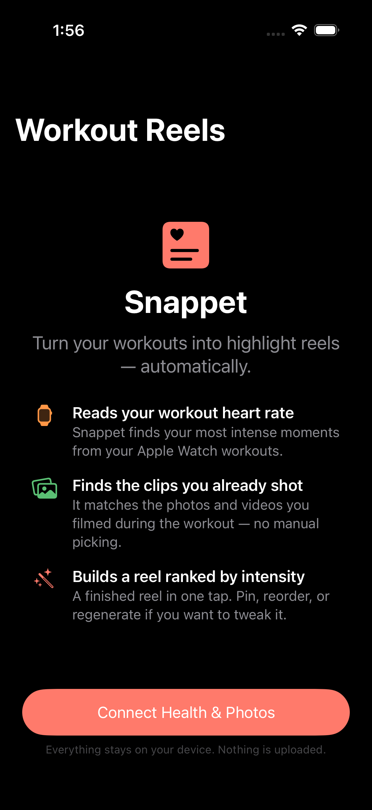 |

| Pomodoro | Habits | Journal |
|---|---|---|
| 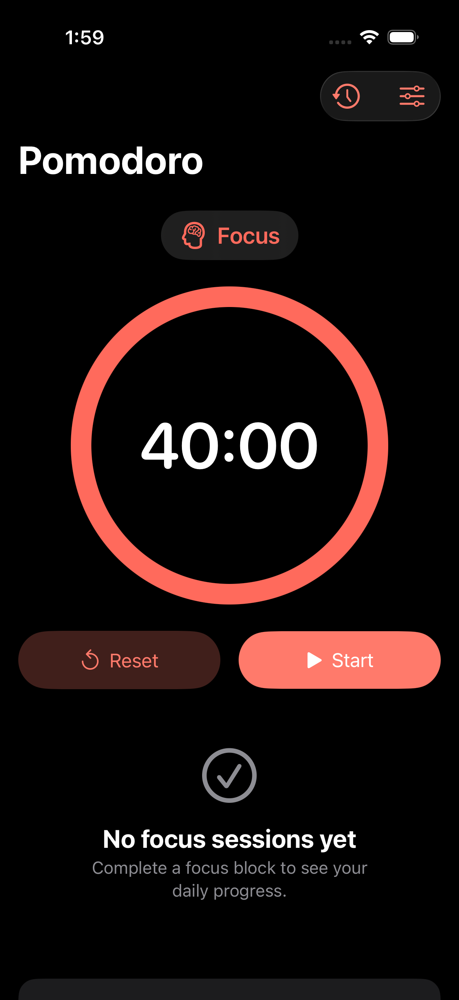 | 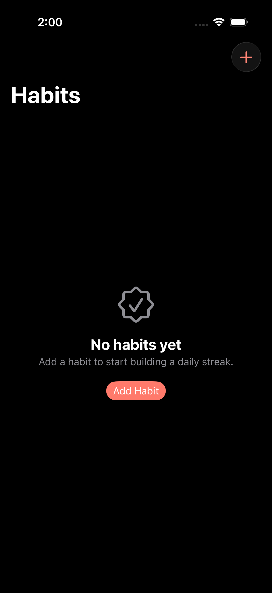 | 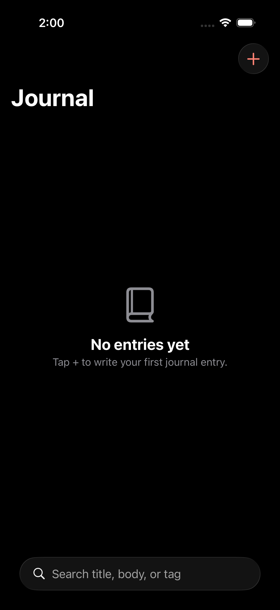 |

| Tip Calculator | Split Expenses | Budget |
|---|---|---|
|  | 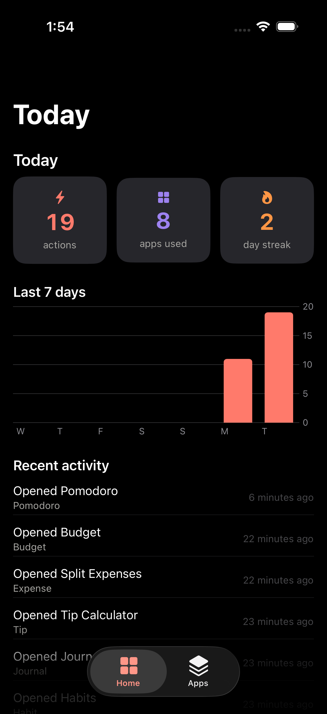 |  |

| Workout dashboard | Routines | Routine detail |
|---|---|---|
| 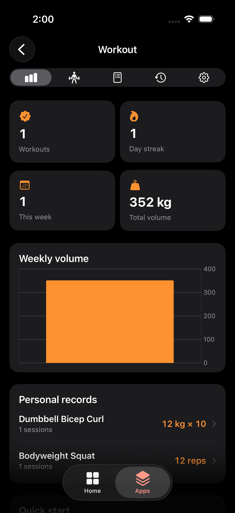 | 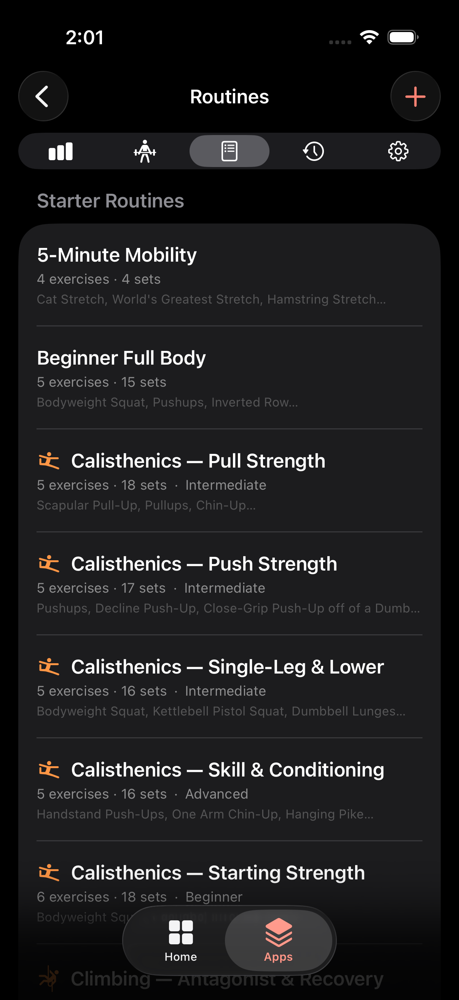 | 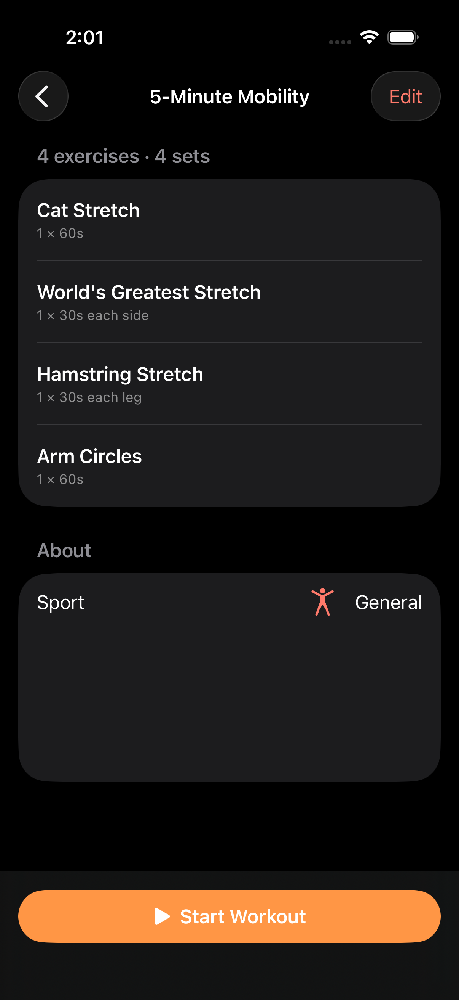 |

| Live player (timer + HR overlay) | History | HR summary (chart + zones) |
|---|---|---|
| 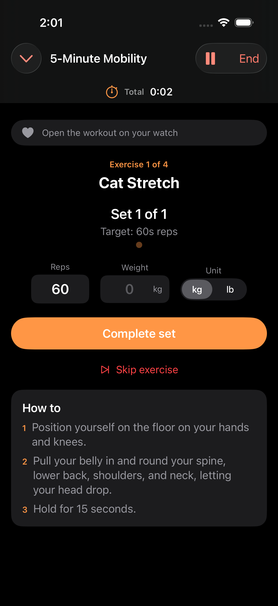 | 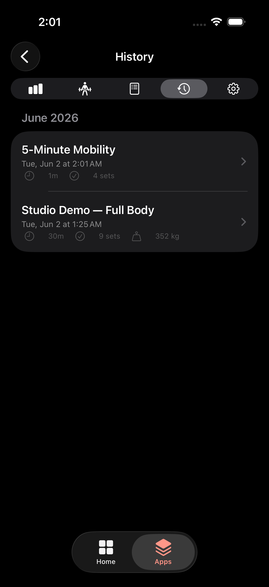 | 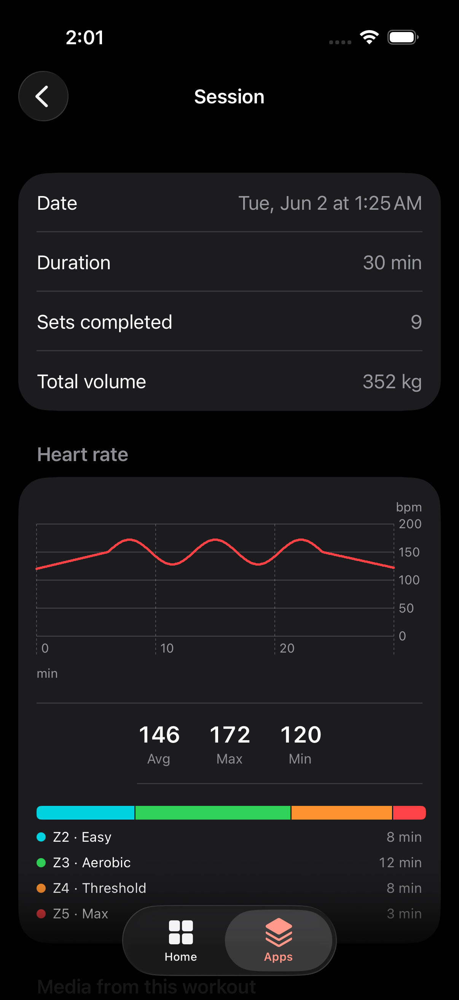 |

| Workout settings | HR source picker (auto-detect · Saved band) | |
|---|---|---|
| 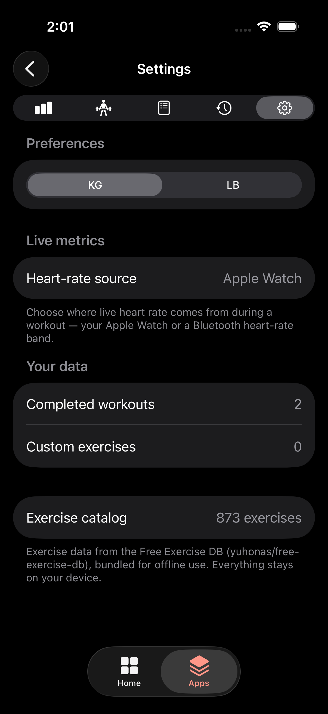 | 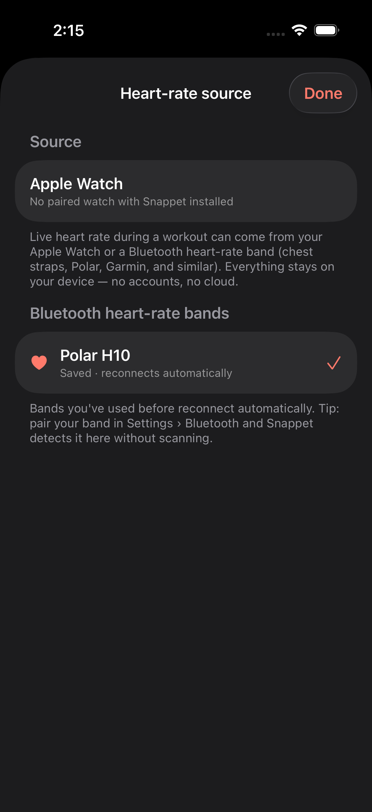 | |

</details>

### ▶ Walkthrough video

A guided walkthrough of the **Live Workout Capture + Video Studio** initiative (A1–B5), in story order —
suite home → routines → the live player → the enriched HR summary → media + highlight → the HR source picker.

<video src="https://github.com/harshal2802/snappet-mobile/raw/main/docs/live-workout-studio-walkthrough.mp4" controls width="320"></video>

If the embedded player doesn't load,
[download / open the walkthrough video](docs/live-workout-studio-walkthrough.mp4) directly.

### 🗺️ Interactive app map

Explore the whole app as a **searchable, interactive knowledge graph** — every screen, sheet,
service, engine component and data model, wired by the navigation and data flows that connect
them. Three layouts, fuzzy search, workflow path-tracing, filters and deep-links; no build step,
fully offline.

**▶︎ [Open the interactive map](https://harshal2802.github.io/snappet-mobile/knowledge-graph/)**
(GitHub Pages) · or open `docs/knowledge-graph/index.html` locally · source &
docs in [`docs/knowledge-graph/`](docs/knowledge-graph/README.md).

> Enabling Pages: **Settings → Pages → Deploy from a branch → `main` / `/docs`**. The site is
> plain static HTML/JS (a `.nojekyll` file makes Pages serve it verbatim).

## Status

🟢 **The Snappet daily-app suite builds and runs** on the iOS simulator (Swift 6 / SwiftUI) and the
Android 15 emulator (Kotlin / Jetpack Compose). A tabbed/bottom-nav shell — **Home** dashboard +
**App Library** — sits over a shared on-device store (**Snappet Core**), with the mini-app modules
wired in: **Workout Reels** (flagship), **Workout Tracker**, **Pomodoro**, **Habits**, **Journal**,
**Tip**, **Split Expenses**, and **Budget**.

The `HighlightEngine` algorithm core passes its full XCTest suite (`swift test`); every non-device
module has a matching UI test (XCUITest on iOS, instrumented Compose tests on Android).

🟡 **Still unproven:** the make-or-break premise — *does a user's own HR pick the highlights they
prefer?* — is validated by the Phase-0 spikes (synthetic verdict so far: **NEEDS-REAL-DATA**), and the
flagship Workout Reels pipeline (HealthKit / Photos / AVFoundation, and the Android Health Connect /
Wear OS / Media3 equivalent) is **device-only** and not yet validated on physical hardware. See the
[iOS device runbook](ios/App/RUNBOOK-device.md) and the current-state writeup in
[`pdd/context/project.md`](pdd/context/project.md).

## Getting started

### iOS (+ watchOS) — requires macOS + Xcode

The Xcode project is generated from `ios/App/project.yml` via
[XcodeGen](https://github.com/yonaskolb/XcodeGen) (no `.pbxproj` churn in git).

```sh
# Generate the project
cd ios/App && xcodegen generate           # → Snappet.xcodeproj
open Snappet.xcodeproj                     # build & run on the iOS 18+ simulator

# The algorithm core is a standalone SPM package — no Xcode, simulator, or device needed:
cd ios/HighlightEngine && swift test       # run the HighlightEngine unit tests
```

The flagship reel pipeline (HealthKit, Photos, AVFoundation) and the watchOS live-HR companion need a
physical iPhone + paired Apple Watch — follow [`ios/App/RUNBOOK-device.md`](ios/App/RUNBOOK-device.md).
See [`ios/README.md`](ios/README.md) for the iOS target overview.

### Android (+ Wear OS)

```sh
cd android
export JAVA_HOME=/path/to/jdk-17
export ANDROID_HOME=/path/to/android-sdk
./gradlew :app:assembleDebug                              # build the debug APK
adb install -r app/build/outputs/apk/debug/app-debug.apk && \
  adb shell am start -n com.snappet.mobile/.MainActivity  # install + launch on the emulator
./gradlew :app:connectedDebugAndroidTest                  # instrumented Compose UI tests
```

Toolchain: AGP 8.7.3 · Gradle 8.11.1 · Kotlin 2.0.21 · compileSdk 35 · minSdk 26. See
[`android/README.md`](android/README.md) for the full module list and emulator-AVD setup.

### Experiments (Phase-0 spikes)

Throwaway Python harnesses (stdlib only, seeded) whose deliverable is a **decision** — see
[`experiments/README.md`](experiments/README.md). Each spike's `RESULTS.md` ends in an explicit
GO / NO-GO / NEEDS-REAL-DATA verdict.

```sh
python3 experiments/hr-highlight-efficacy/run.py          # the make-or-break spike
```

## Structure

```
ios/             iOS-first: Swift/SwiftUI app + watchOS companion (HealthKit, AVFoundation)
  HighlightEngine/   pure-Swift SPM package — the selection algorithm, ZERO platform deps
  App/               the SwiftUI app, watchOS companion, and widgets (XcodeGen project)
android/         Android: Kotlin / Jetpack Compose (Health Connect, Wear OS, Media3)
experiments/     throwaway Phase-0 spikes (HR-highlight efficacy, media↔HR time-sync, feedback replay)
docs/            screenshots, TestFlight + OTA-release notes
pdd/             Prompt-Driven Development layer — context, prompts, and the roadmap
```

The core architectural rule: **`HighlightEngine` stays platform-free** (no HealthKit / AVFoundation /
Photos / UIKit / SwiftUI imports). Platform I/O lives in `ios/App/Snappet/Services/`, and the engine
meets the app in exactly one place (`AppModel`) so the selection algorithm is swappable and tunable in
one spot. Details in [`pdd/context/conventions.md`](pdd/context/conventions.md).

## How this repo relates to the web hub

This is the **native** companion to the web hub at
[harshal2802/Snappet](https://github.com/harshal2802/Snappet). It is a *separate repo on purpose*
(different release lifecycle, toolchain, and risk profile — see the rationale in the web repo's
`pdd/context/decisions.md`, 2026-05-30 entry). The web repo is the **product brain**:

| What | Where |
|---|---|
| Deep research (feasibility + UX) | [Snappet#60](https://github.com/harshal2802/Snappet/issues/60) |
| Initiative plan & prompt chain | `pdd/prompts/features/native-mobile/PLAN-snappet-mobile.md` (web repo) |
| **Snappet Core** shared data-schema spec | `pdd/context/snappet-core-schema.md` (web repo) |

The schema is **copied/generated** into this repo per platform when implementation starts — it is not
a runtime import. When the schema changes, it changes in the web repo first.

## How this repo is developed (PDD)

This repo uses **Prompt-Driven Development**. The implementation context and the prompt chain that
drives the code live in [`pdd/`](pdd/) — start at [`pdd/context/project.md`](pdd/context/project.md)
for the reality-based current state, and
[`pdd/prompts/features/PLAN-ios-to-shippable.md`](pdd/prompts/features/PLAN-ios-to-shippable.md) for
the v0.1 → shippable roadmap. The web repo stays the product brain; `pdd/` owns platform specifics.

## Roadmap

- **Phase 0 — spikes:** HR-highlight efficacy · media↔HR time-sync · on-device reel assembly · watch→phone live-HR relay
- **Phase 1 — iOS MVP:** Apple Watch + one activity + library import + %HRR highlight engine + on-device reel + Snappet Core + daily-home card
- **Phase 2 — polish iOS** · **Phase 3 — suite/shared data** · **Phase 4 — Android** · **Phase 5 — generic BLE bands**
- **Post-v1:** Live Workout Capture + Video Studio — watchOS companion (live HR/timers/background),
  session media tagging, a CapCut-style clip editor, and engine-driven highlight generation
  ([#15](https://github.com/harshal2802/snappet-mobile/issues/15)).

## Contributing

See [CONTRIBUTING.md](CONTRIBUTING.md) for the development workflow, coding conventions, the
platform-free engine rule, how to add a mini-app to the suite, testing requirements, and commit/PR
conventions.

## License

Source-available under the **[PolyForm Noncommercial License 1.0.0](LICENSE)**. Free to use,
modify, and share for any **non-commercial** purpose (personal, hobby, research, education).
**Commercial or for-profit use requires separate written permission** from the copyright holder —
open an issue to request a commercial license. (Source-available, not an OSI "open source" license.)
