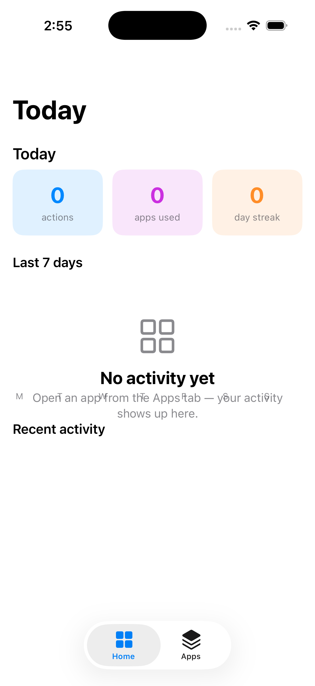
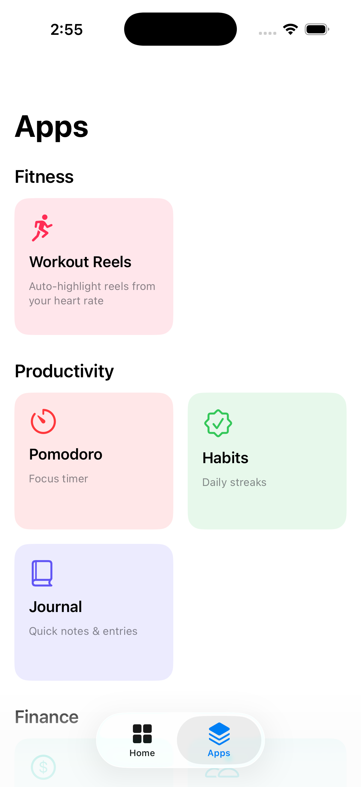
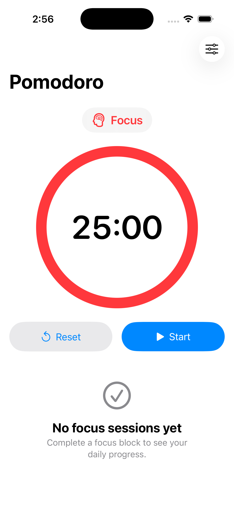
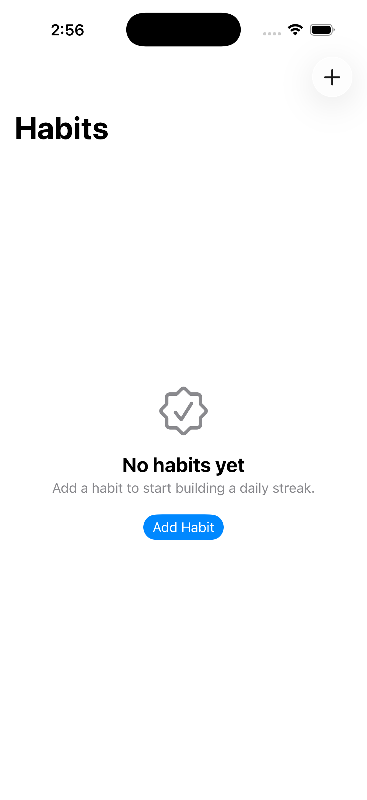
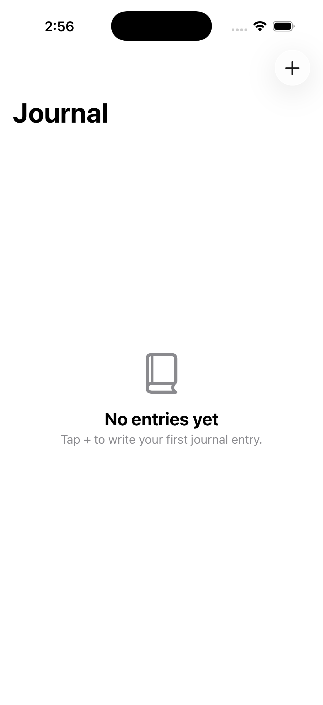
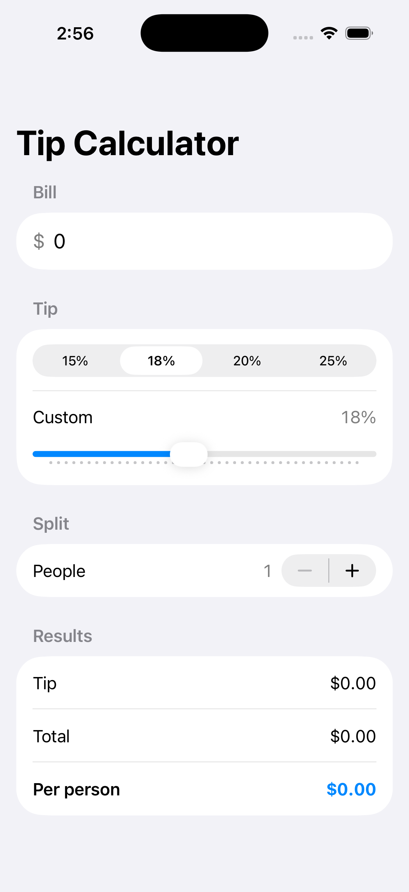
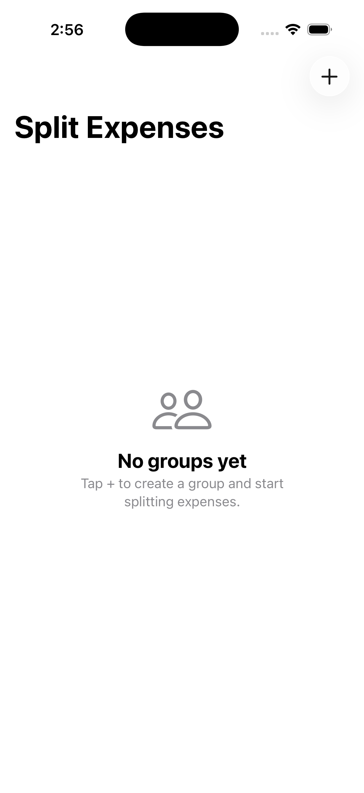
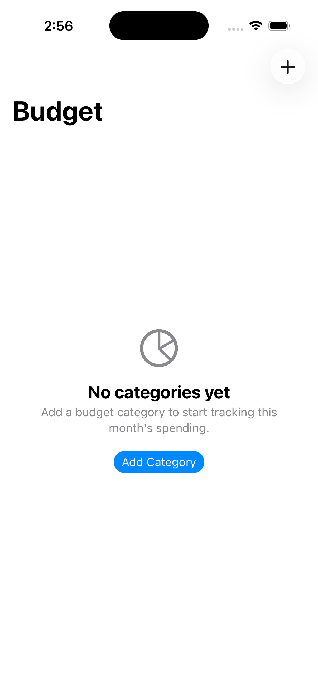

# Snappet Mobile

Native iOS + Android app for **Snappet** — a suite of small daily-utility mini-apps that share one
on-device data layer to become a go-to daily app.

## Screens

The iOS suite — a Home dashboard aggregating usage across mini-apps, an App Library, and the modules
themselves (Workout reels · Pomodoro · Habits · Journal · Tip · Split Expenses · Budget). Captured on
the iOS 26 simulator.

| Home dashboard | App Library | Workout (onboarding) |
|---|---|---|
|  |  |  |

| Pomodoro | Habits | Journal |
|---|---|---|
|  |  |  |

| Tip Calculator | Split Expenses | Budget |
|---|---|---|
|  |  |  |

**Flagship feature:** workout-tracking + **HR-driven auto-highlight reels** — track a workout's heart
rate (Apple Watch / Wear OS / BLE band), film however you like, and the app auto-finds the media you
shot during the workout window and assembles a highlight reel ranked by heart-rate intensity, with
minimal manual editing.

> This is the **native** companion to the web hub at
> [harshal2802/Snappet](https://github.com/harshal2802/Snappet). It is a *separate repo on purpose*
> (different release lifecycle, toolchain, and risk profile — see the rationale in the web repo's
> `pdd/context/decisions.md`, 2026-05-30 entry).

## Source of truth lives in the web repo (the "product brain")

| What | Where |
|---|---|
| Deep research (feasibility + UX) | [Snappet#60](https://github.com/harshal2802/Snappet/issues/60) |
| Initiative plan & prompt chain | `pdd/prompts/features/native-mobile/PLAN-snappet-mobile.md` (web repo) |
| **Snappet Core** shared data-schema spec | `pdd/context/snappet-core-schema.md` (web repo) |

The schema is **copied/generated** into this repo per platform when implementation starts — it is not
a runtime import. When the schema changes, it changes in the web repo first.

## How this repo is developed (PDD)

This repo uses **Prompt-Driven Development**. The iOS-implementation context and the prompt chain that
drives the code live in [`pdd/`](pdd/) — start at [`pdd/context/project.md`](pdd/context/project.md)
for the reality-based current state, and [`pdd/prompts/features/PLAN-ios-to-shippable.md`](pdd/prompts/features/PLAN-ios-to-shippable.md)
for the v0.1 → shippable roadmap. The web repo stays the product brain; `pdd/` owns iOS specifics.

## Status

🟡 **Pre-implementation.** The make-or-break premise (does a user's *own* HR pick highlights they
prefer?) is unproven and is validated first via the Phase-0 spikes.

## Structure

```
ios/           # iOS-first: Swift/SwiftUI app + watchOS companion (HealthKit, AVFoundation)
android/       # Android: Kotlin (Wear OS Health Services, Health Connect, Media3)  — later phase
experiments/   # throwaway Phase-0 spikes (HR-highlight efficacy, media↔HR time-sync)
```

## Roadmap (see PLAN in the web repo)

- **Phase 0 — spikes:** HR-highlight efficacy · media↔HR time-sync · on-device reel assembly · watch→phone live-HR relay
- **Phase 1 — iOS MVP:** Apple Watch + one activity + library import + %HRR highlight engine + on-device reel + Snappet Core + daily-home card
- **Phase 2 — polish iOS** · **Phase 3 — suite/shared data** · **Phase 4 — Android** · **Phase 5 — generic BLE bands**

## License

TBD.
