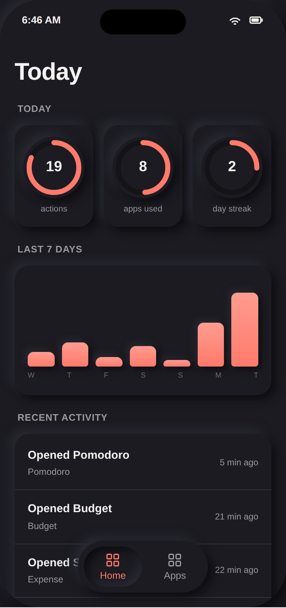
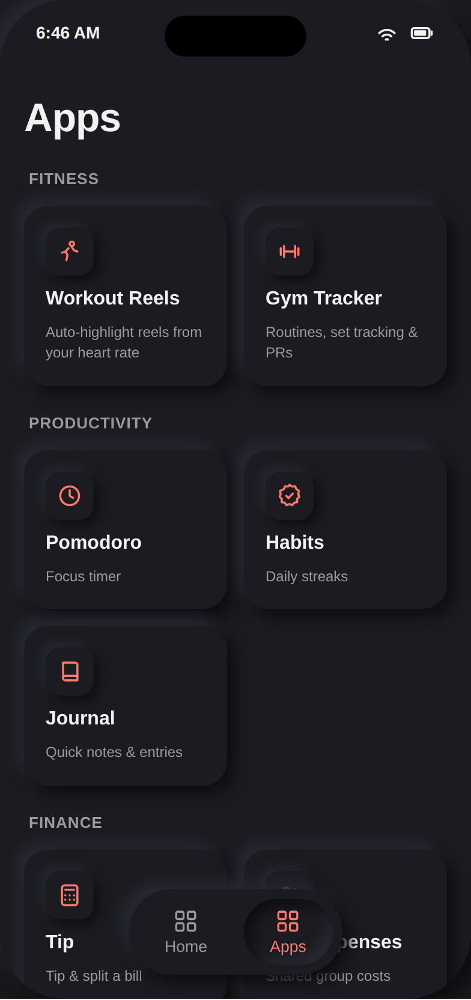
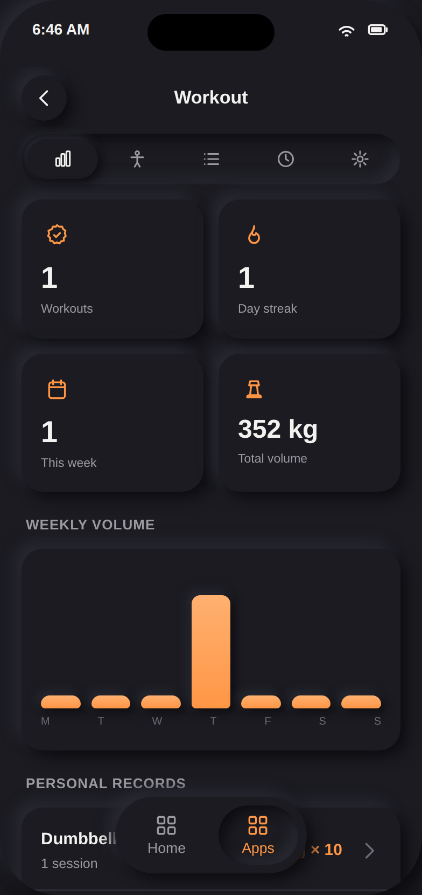
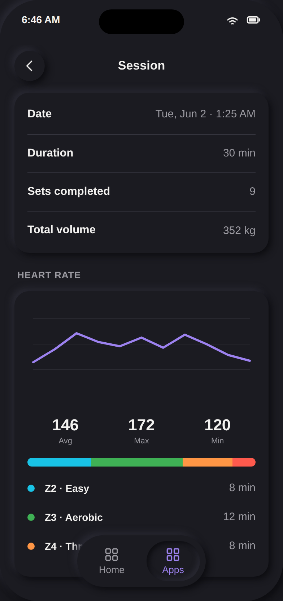
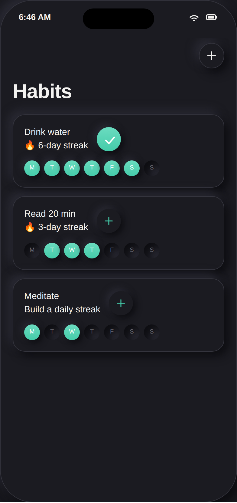
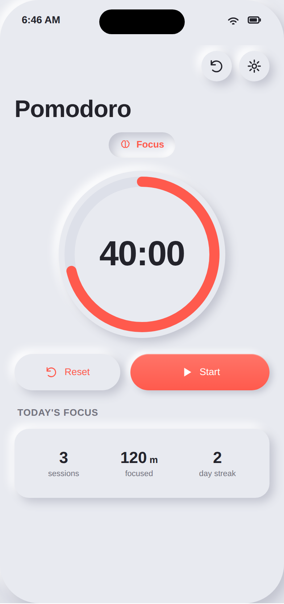
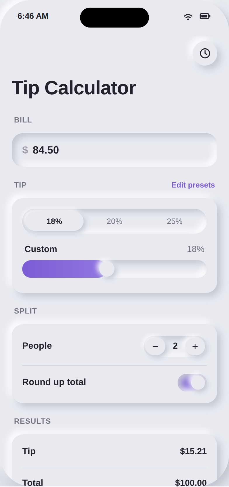
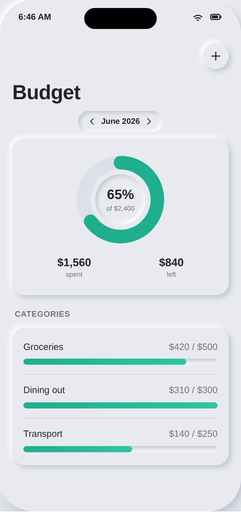

# Snappet · "Soft Pulse" — a neumorphic design exploration

**Status:** design exploration / review artifact. **Nothing here is wired into the shipping app** —
it changes no screens, no navigation, no logic. It's a self-contained set of interactive wireframes
plus the research and a concrete, low-risk path to land the look in SwiftUI later.

**▶︎ Open [`index.html`](./index.html)** in any browser (no build, fully offline). Use the controls to
switch **appearance** (Dark / Light), **color scheme** (Pulse Coral / Ember / Indigo / Teal) and
**depth / contrast** (Soft / Balanced / High), and tap inside the phone to move between screens.

> The brief: take the dark "soft-UI" look from the reference screenshot, research how to bring it to
> Snappet, offer **multiple contrast + color options the user can choose from**, and produce
> real-looking wireframes for every screen **without changing any flow**.

---

## 1. What the reference style is called

The reference is **dark neumorphism** — also called **soft UI** (a portmanteau of *new* +
*skeuomorphism*). Its mechanics:

- **Surfaces are extruded from the background, not layered on top of it.** The card fill is the *same*
  color as the page; depth comes entirely from a **pair of shadows** — one darker (bottom-right) and
  one lighter (top-left). Inset versions of the same two shadows read as "pressed in."
- **Monochromatic + sparse accent.** One brand hue for action, everything else neutral.
- **Large radii, soft diffuse shadows, no hard borders.**

(A glassmorphism cousin uses translucency/blur instead of extrusion — not what the reference is.)

## 2. Deep research — the one thing that matters

Neumorphism's signature weakness is **contrast/accessibility**. Because the surface equals the
background and shape is carried by soft shadows, controls can fall below **WCAG** non-text contrast
(3:1) and text below 4.5:1 — buttons "disappear," and affordances (what's tappable) get ambiguous.
This is the consistently-cited reason it never became a default.

The current (2025, "Neumorphism 2.0") best practice resolves the tension with three rules:

1. **Apply it selectively** — to containers, gauges, toggles, cards — and pair with flatter, clearly
   readable content. Don't neumorph the whole screen into mush.
2. **Adaptive / higher contrast** — give users (or the system) a way to deepen shadows and add a
   hairline so depth and edges stay legible; keep **text and the action accent at full contrast**.
3. **Explicit interaction feedback** — pressed = inset, plus motion/haptics, so taps are obvious.

These map almost exactly onto what Snappet already is: a **bold-text, high-contrast** suite anchored by
one coral accent and a curated per-module palette (`SnappetColor`), on a strict spacing/radius scale
(`SnappetSpacing` / `SnappetRadius`) with one shared card surface (`SnappetCard`). So the right move
for Snappet is **not** "pure neumorphism" — it's a **hybrid**:

> **Soft Pulse** = keep the Pulse identity (Pulse Coral, bold ink text, per-module accents, the 4-pt
> scale) and re-skin the *surfaces* with neumorphic extrusion, with a **user-selectable depth** so the
> accessibility dial is in the user's hands.

That hybrid is what the wireframes render.

## 3. The options the user can choose from (three independent axes)

The whole system is three orthogonal choices, so the matrix is large but the rules are tiny. In the
wireframes these are the three controls; in the app they'd be **Settings → Appearance**.

| Axis | Options | What it controls |
|---|---|---|
| **Appearance** | **Dark** · **Light** | The neutral ramp. Dark matches the reference (true-dark, extruded charcoal). Light is the classic soft-UI putty-grey. Both already exist as dynamic tokens. |
| **Color scheme** | **Pulse Coral** · **Ember** · **Indigo** · **Teal** | The action accent (CTAs, selection, gauges). All four are pulled from the existing `SnappetColor` ramp, so module-accent wayfinding is untouched. Coral is the default = no brand change. |
| **Depth / contrast** | **Soft** · **Balanced** · **High** | The **accessibility dial**. Soft = subtle (reference-like). Balanced = default. **High** deepens the shadow delta *and adds a 1-pt hairline* so edges/affordances pass non-text contrast — the answer to the neumorphism critique. |

Recommended default: **Pulse Coral · Dark · Balanced** (closest to today's look, with the new depth).
Suggested first-run a11y behavior: if the OS has **Increase Contrast** on, start at **High** and skip
the softest shadows.

## 4. How to implement in SwiftUI — small, token-level, zero flow change

The whole point: this lands as a **design-token + view-modifier change**, in exactly the seam the repo
already uses for "change the surface in one place." No screen, view model, navigation, or engine code
moves. Concretely, in `ios/App/Snappet/DesignSystem/`:

1. **`SnappetColor.swift`** — add the shadow tokens the extrusion needs (dynamic light/dark):
   `shadowDark`, `shadowLight`, and tune `surface` to sit *equal to* `paper` for true neumorphism
   (the surface-equals-background rule). Keep `ink` / `textSecondary` / accents exactly as they are so
   text contrast is unchanged.
2. **`SnappetCard.swift`** — add a `.snappetNeu()` / `.snappetNeuInset(_ pressed:)` modifier alongside
   the existing `.snappetCard()` / `.snappetTile()`. The outer shadow is **two stacked `.shadow()`
   calls** (dark offset +x/+y, light offset −x/−y); the pressed/inset state uses an inner-shadow
   technique (a small helper, or the well-known `costachung/neumorphic` SwiftUI package if we choose to
   vendor one — inner shadows aren't a one-liner in SwiftUI). Existing call sites can keep
   `.snappetCard()`; flipping the suite is a one-modifier swap.
3. **New `SnappetTheme` (an `@Observable`, injected via `.environment`, persisted in `@AppStorage`)** —
   holds the three axes and exposes the resolved shadow geometry (`distance`, `blur`, `hairline`) for
   Soft/Balanced/High. Read it where the modifier computes its shadows. Honor
   `@Environment(\.accessibilityReduceTransparency)` and Dynamic Type.

That's it — `SnappetRadius` / `SnappetSpacing` are already correct, and because the engine/services and
all `Features/<App>/` views consume tokens (not raw colors), re-skinning is centralized exactly like
the conventions describe.

### Accessibility guardrails to ship with it
- Body/label text stays on `ink` / `textSecondary` → **≥ 4.5:1** in both appearances (unchanged).
- **High** depth adds the hairline + deeper shadows so interactive surfaces meet **3:1** non-text.
- Pressed = inset **plus** the existing `Haptics` tap; never rely on shadow alone to signal state.
- Respect **Reduce Motion** (no shadow animation) and **Increase Contrast** (default to High).

## 5. What the wireframes cover

Every primary surface in the suite, faithful to the real layouts (populated with realistic data so the
design can be judged on real content, not empty states):

Home · App Library · Pomodoro · Habits · Journal · Tip Calculator · Split Expenses · Budget ·
Workout dashboard · Workout exercises · Routines · Routine detail · Workout history · Workout settings ·
HR session summary (chart + zones) · Live player · Heart-rate source sheet.

Navigation inside the phone mirrors the app exactly (Home/Apps tab bar, the Workout segmented control,
list-row drill-in, the HR-source sheet) — **no flow is added or removed.**

### Preview gallery (rendered from `index.html`)

| | | |
|---|---|---|
|  |  |  |
| Home — Pulse Coral · Dark · Balanced | App Library — Coral · Dark | Workout — Ember · Dark |
|  |  |  |
| HR summary — Indigo · Soft | Habits — Teal · **High** contrast | Pomodoro — Coral · **Light** |
|  |  | |
| Tip — Indigo · Light | Budget — Teal · Light | |

## 6. Caveats

- This is a **prototype for review**, not production code. The wireframes are HTML/CSS approximations of
  SwiftUI, not the app; final pixel values get tuned against the real device.
- No knowledge-graph (`docs/knowledge-graph/data.js`) edit is included because **no app node changed** —
  these are mockups. When/if Soft Pulse is actually implemented, the design-system change gets recorded
  in `pdd/context/decisions.md` and a feature prompt per the PDD workflow.
- Implementing the SwiftUI side needs macOS + Xcode (the usual constraint).

## 7. Sources

- [Neumorphism: its rise and fall in UI design — Webflow](https://webflow.com/blog/neumorphism)
- [Neumorphism in UI design: principles & best practices — LogRocket](https://blog.logrocket.com/ux-design/neumorphism-ui-design/)
- [Neumorphism in modern UI — pros, cons & best practices — Gaps Studio](https://gapsystudio.com/blog/neumorphism-in-modern-interfaces/)
- [Neumorphism 2.0 & skeuomorphism: 2025 UI trends](https://ecommercewebdesign.agency/the-rise-of-neumorphism-2-0-soft-shadows-and-skeuomorphism-in-2025-designs/)
- [How to build neumorphic designs with SwiftUI — Hacking with Swift](https://www.hackingwithswift.com/articles/213/how-to-build-neumorphic-designs-with-swiftui)
- [How to create neumorphic design in SwiftUI — Sarunw](https://sarunw.com/posts/how-to-create-neomorphism-design-in-swiftui/)
- [`costachung/neumorphic` — SwiftUI soft-UI utility (outer + inner shadow)](https://github.com/costachung/neumorphic)
</content>
</invoke>
